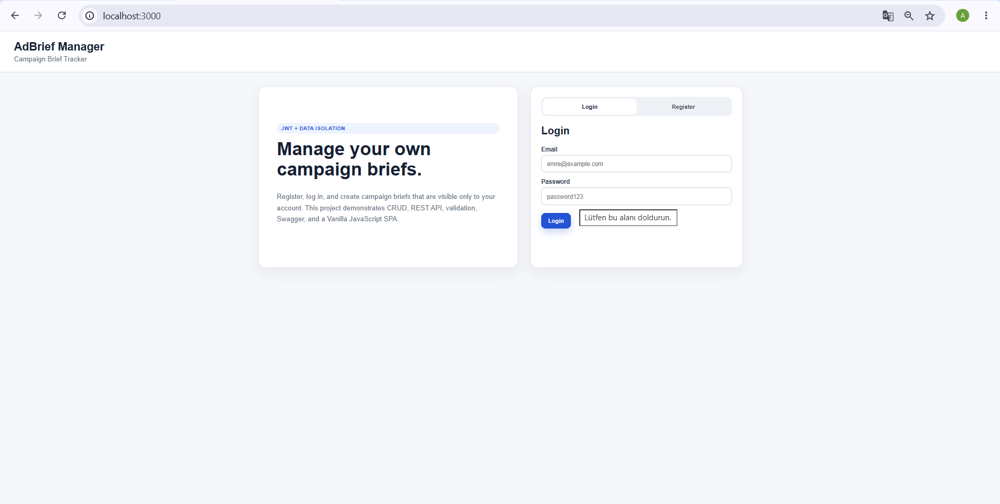
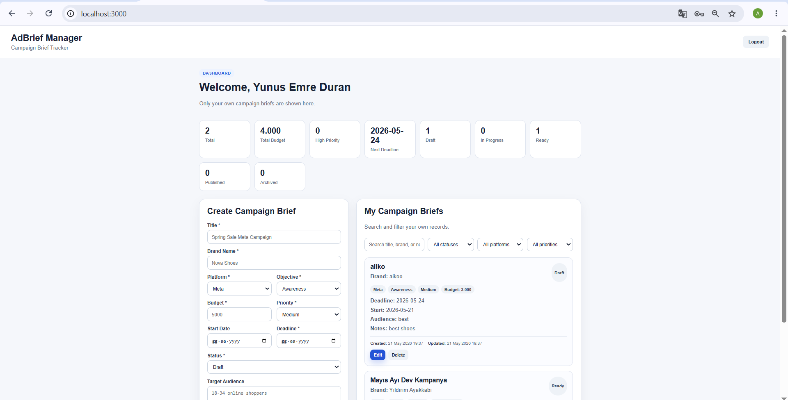
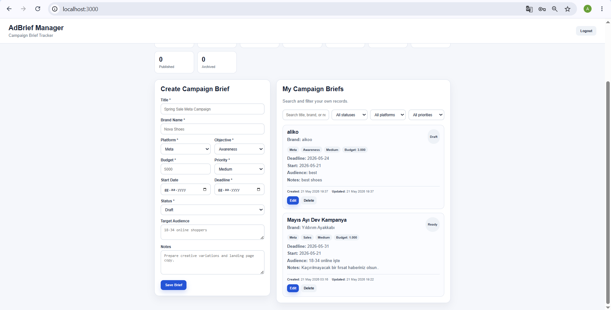
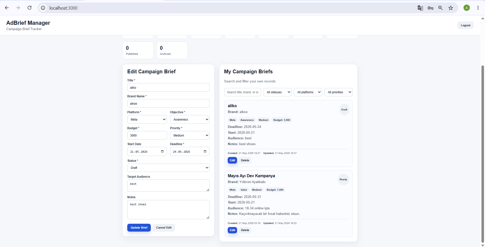
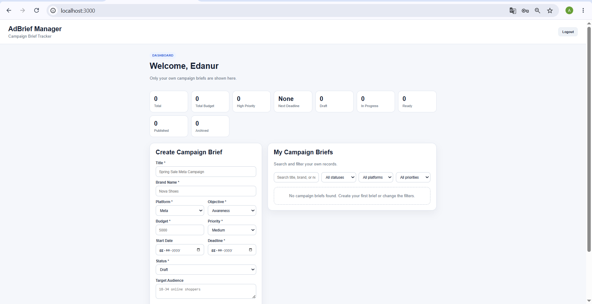
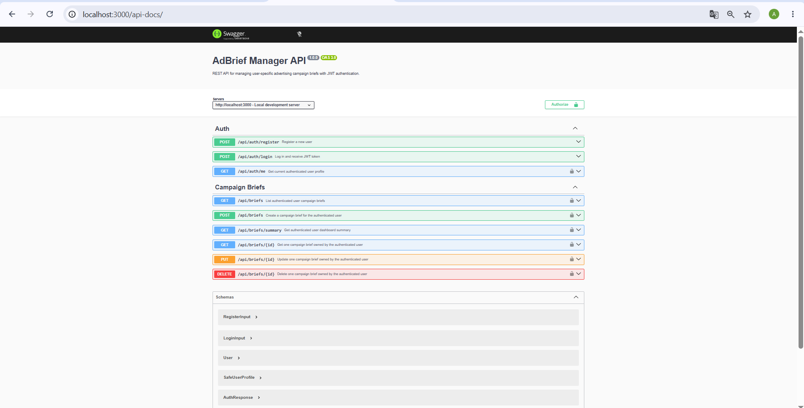
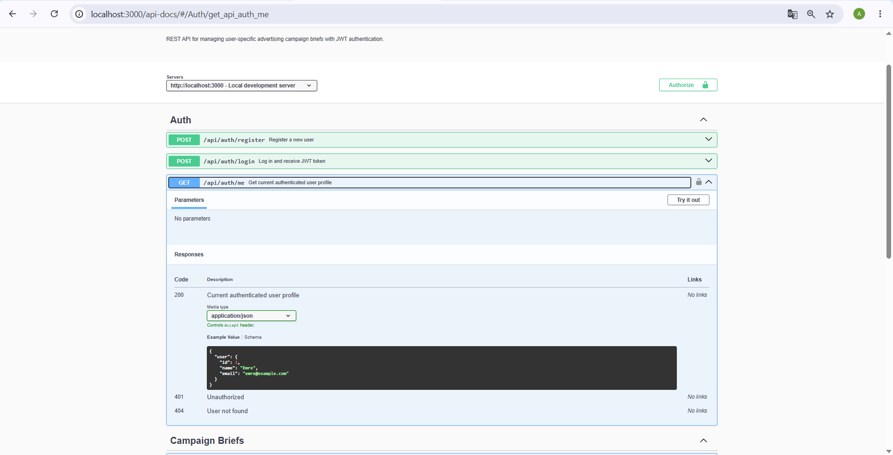
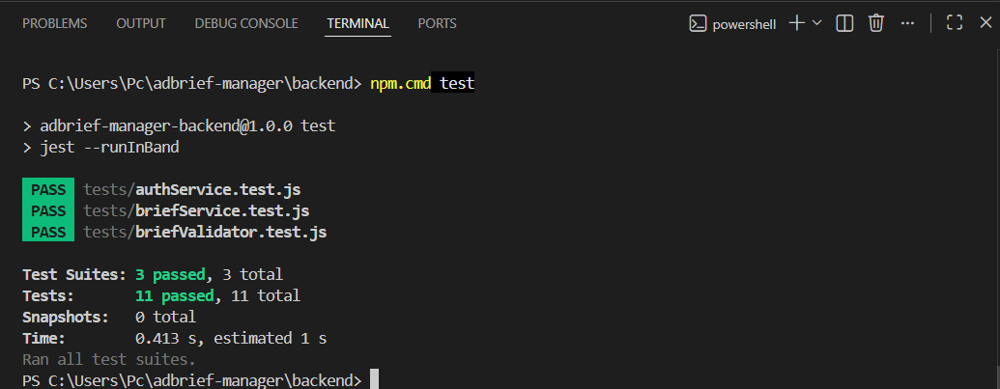
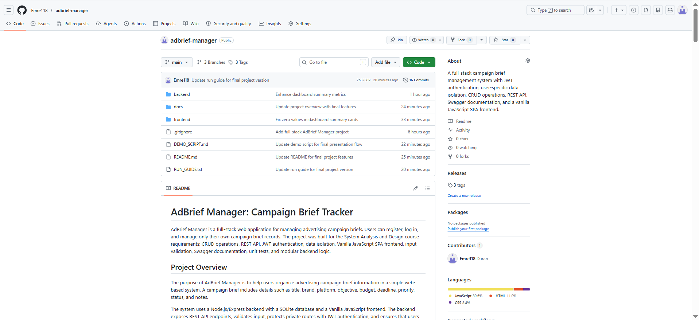

# Screenshots

This folder contains final screenshots for the AdBrief Manager project.

## Screenshot List

### 1. Login and Register Screen

Shows the authentication screen where users can register or log in.

---

### 2. User Dashboard

Shows the authenticated user dashboard with final summary metrics such as Total, Total Budget, High Priority, Next Deadline, Draft, In Progress, Ready, Published, and Archived.

---

### 3. Campaign Brief Creation Form

Shows the form used to create a campaign brief with title, brand name, platform, objective, budget, dates, status, target audience, and notes.

---

### 4. Campaign Brief Metadata

Shows campaign brief cards with Created At and Updated At metadata, along with edit and delete actions.

---

### 5. User-Specific Data Isolation

Demonstrates that a second user cannot see the first user's campaign brief records.

---

### 6. Swagger API Documentation

Shows the Swagger UI page with Auth and Campaign Brief API endpoints.

---

### 7. Authenticated User Endpoint

Shows the protected GET /api/auth/me endpoint in Swagger UI.

---

### 8. Unit Tests Passing

Shows the final Jest test result with 3 test suites and 11 tests passing.

---

### 9. GitHub Repository

Shows the final GitHub repository page with project files, documentation, and version-controlled structure.

